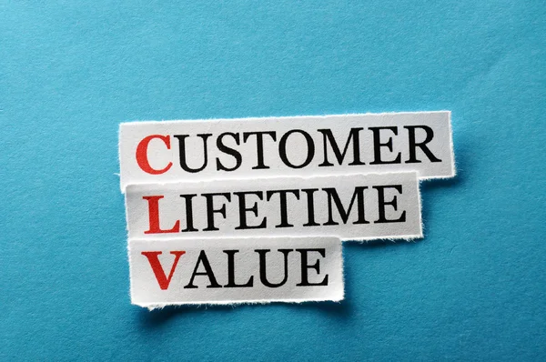
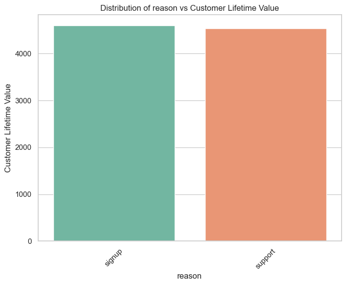
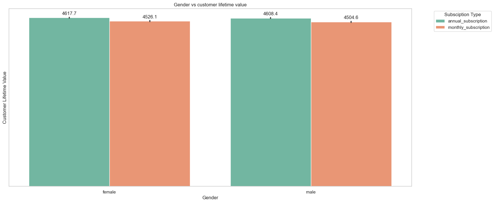
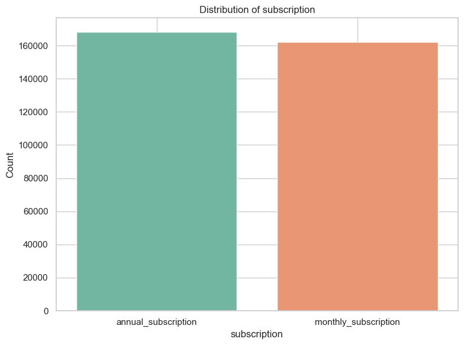
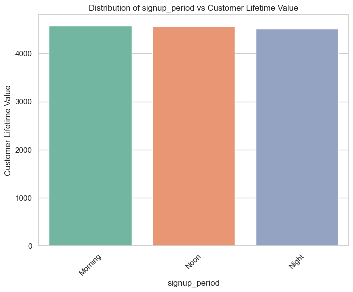
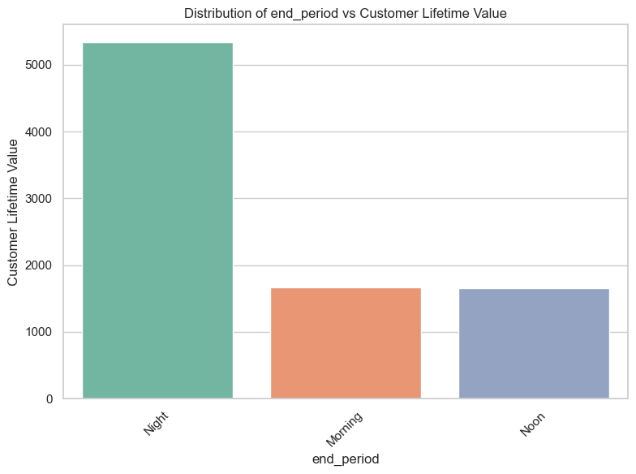
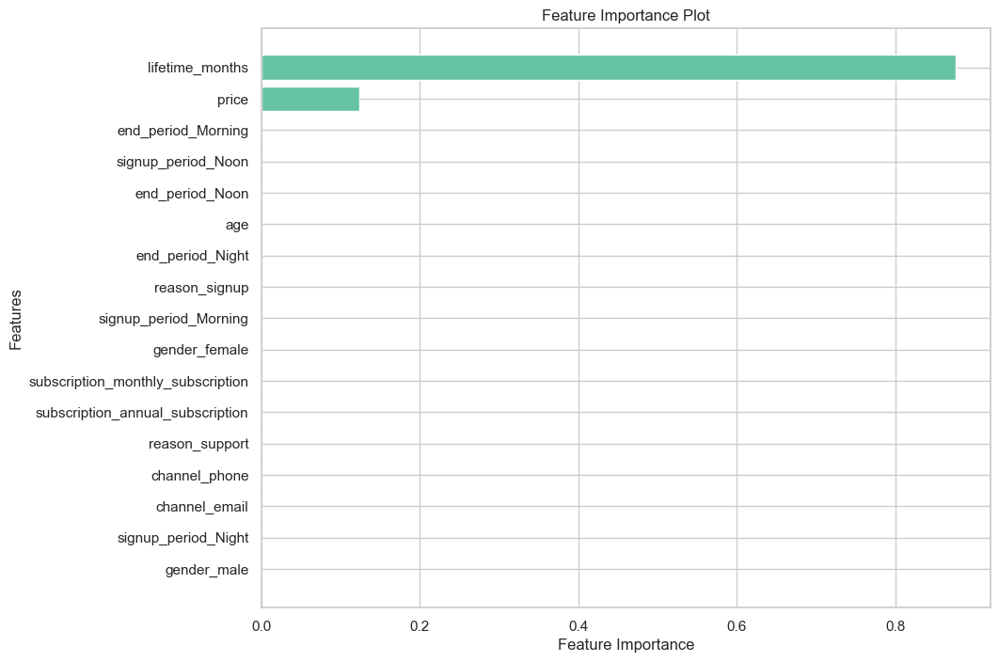

# Customer-Lifetime-Value-CLV-Prediction-Project

## Introduction.
Customer Lifetime Value (CLV) prediction is crucial for businesses offering subscription services. By accurately estimating the long-term value of customers, companies can tailor marketing strategies, improve customer retention efforts, and optimize resource allocation for maximum revenue. This proposal outlines a comprehensive approach to develop a CLV prediction model using machine learning techniques.

## Problem Statement.
The objective of developing a predictive model for estimating Customer Lifetime Value (CLV) holds profound significance for businesses operating subscription-based services. By accurately forecasting the long-term value of individual customers, this endeavor aims to provide several key benefits:

a) Resource Allocation: A robust CLV prediction model enables businesses to make informed decisions regarding resource allocation. By understanding the potential value that each customer brings over their entire relationship with the company, organizations can strategically allocate resources such as marketing budgets, customer service efforts, and product development initiatives. This ensures optimal resource utilization and efficiency, maximizing the return on investment.

b) Marketing Strategy Optimization: Armed with insights from CLV predictions, businesses can fine-tune their marketing strategies to effectively target high-value customers. By identifying and prioritizing segments of customers with the highest CLV, organizations can tailor marketing campaigns and promotional offers to resonate with their preferences and behaviors. This targeted approach enhances the effectiveness of marketing efforts, driving higher conversion rates and revenue generation.

c) Customer Retention Programs: Implementing strategic customer retention programs is essential for fostering long-term loyalty and profitability. CLV predictions provide valuable insights into the unique needs and behaviors of different customer segments, enabling organizations to design tailored retention initiatives. By proactively addressing churn risk factors and enhancing customer satisfaction, businesses can extend customer lifetimes, increase retention rates, and ultimately, boost profitability.

To achieve these objectives, the CLV prediction model will leverage advanced machine learning techniques, including data preprocessing, feature engineering, model selection, and validation. Continuous monitoring and refinement of the model will be essential to adapt to evolving customer dynamics and market conditions, ensuring its effectiveness in driving strategic decision-making and business growth.

## Objectives.
The outlined steps provide a structured approach to developing a Customer Lifetime Value (CLV) prediction model, enabling businesses to leverage historical customer transaction data for strategic decision-making and resource allocation. Let's delve deeper into each step:

a) Collect and Preprocess Historical Customer Transaction Data:

This initial phase involves gathering comprehensive data on customer transactions, including purchase history, frequency, monetary value, and other relevant metrics. The data collected may encompass various channels such as online purchases, in-store transactions, subscription renewals, and customer interactions. Preprocessing steps involve data cleaning, handling missing values, outlier detection, and normalization to ensure data quality and integrity.

b) Engineer Relevant Features:

Feature engineering is a critical step in capturing key aspects of customer behavior and purchasing patterns. This involves extracting meaningful features from the raw transaction data, such as customer demographics, purchase frequency, recency, monetary value, average order value, and customer lifetime duration. Additionally, behavioral features like browsing history, engagement metrics, and product interactions may be incorporated to enrich the predictive capabilities of the model.

c) Select Appropriate Machine Learning Algorithms and Models:

The selection of suitable machine learning algorithms and models plays a crucial role in the accuracy and effectiveness of CLV prediction. Various algorithms, including regression models, decision trees, ensemble methods, and neural networks, may be evaluated based on their ability to handle the complexity of the dataset and capture nonlinear relationships. Ensemble techniques such as Gradient Boosting Machines (GBM) or Random Forests are often preferred for their robustness and predictive power.

d) Train and Evaluate Model Performance:

Once the model architecture is defined, it is trained on the preprocessed dataset using appropriate training and validation techniques. The model's performance is evaluated using relevant metrics such as Root Mean Squared Error (RMSE), Mean Absolute Error (MAE), or R-squared (R^2) to assess its predictive accuracy and generalization capabilities. Cross-validation techniques may be employed to ensure the model's robustness and reliability across different datasets.

e) Provide Actionable Insights and Recommendations:

The final phase involves interpreting the model results and deriving actionable insights and recommendations for business stakeholders. Insights may include identifying high-value customer segments, predicting future CLV trajectories, and uncovering factors driving customer churn or retention. These insights enable businesses to formulate targeted marketing strategies, optimize customer engagement initiatives, and allocate resources effectively to maximize CLV and overall profitability.

## Metric of Success.
**Root Mean Squared Error (RMSE):** This metric measures the average magnitude of the errors between predicted values and actual values. A lower RMSE indicates better accuracy of the predictive model in estimating the target variable.

**Mean Absolute Error (MAE):** MAE quantifies the average magnitude of errors between predicted and actual values, without considering their direction. It provides a measure of the model's accuracy in predicting the target variable.

**Coefficient of Determination (R-squared):** R-squared represents the proportion of variance in the target variable that is explained by the independent variables in the model. It ranges from 0 to 1, where a value closer to 1 indicates that the model explains a larger proportion of the variance and is considered a better fit.

## Data Understanding.
This data is about a subscription-based digital product offering for financial advisory that includes newsletters, webinars, and investment recommendations. The offering has a couple of varieties, annual subscription, and digital subscription. The product also provides daytime support for customers to reach out to a care team that can help them with any product-related questions and signup/cancellation-related queries.

The data set contains the following information:

a) Customer sign-up and cancellation dates at the product level

b) Call center activity

c) Customer demographics

d) Product pricing info

This dataset was obtained from [Kaggle](https://www.kaggle.com/datasets/gsagar12/dspp1?resource=download&select=customer_product.csv)

## Feature Analysis.

The correlation in p-value terms between the selected categorical columns—channel, reason, gender, subscription, signup_period, and end_period—and the target variable (Customer Lifetime Value) show statistically significant correlations.

Channel and Reason: The p-values for both channel and reason are extremely low (5.31e-107 and 1.42e-15, respectively), indicating a strong statistical significance. This suggests that the choice of channel and reason significantly affects customer lifetime value.

Gender: The p-value for gender is 0.029, which is below the conventional threshold of 0.05, indicating a statistically significant correlation. This implies that gender has a measurable impact on customer lifetime value.

Subscription: Similarly, the p-value for subscription is very low (2.29e-59), indicating a strong statistical significance. Therefore, the type of subscription chosen by the customer significantly influences their lifetime value.

Signup Period and End Period: The p-values for signup_period and end_period are 0.002 and 0.0, respectively. These low p-values suggest significant correlations, indicating that the time period during which customers sign up and end their subscriptions also affect customer lifetime value.

Overall, the low p-values across all categorical columns indicate that the choice of channel, reason, gender, subscription, signup_period, and end_period have a significant impact on customer lifetime value.

## Modeling.
RMSE (Root Mean Squared Error): The XGBoost model has a significantly lower RMSE compared to the linear regression benchmark model, indicating better predictive accuracy.

MAE (Mean Absolute Error): Similar to RMSE, the XGBoost model's MAE is much lower than that of the linear regression benchmark, implying better prediction accuracy.

R^2 (Coefficient of Determination): The R^2 value for the XGBoost model is extremely close to 1, indicating that the model explains almost all the variance in the target variable, while the linear regression benchmark model's R^2 is also high but slightly lower than XGBoost.

Overall, the XGBoost model outperforms the linear regression benchmark model across all metrics, demonstrating superior predictive performance.

The cross-validation RMSE is slightly higher compared to the RMSE from the train-test split. This difference is expected since cross-validation provides a more robust estimate of the model's performance by averaging over multiple data splits. Despite the slight increase in RMSE, both methods show exceptional performance of the XGBoost model on the dataset.

In summary, the XGBoost model demonstrates consistent and outstanding performance across different evaluation techniques, indicating its reliability and effectiveness in predicting the target variable.

#### Modeling with Random Forest.

The Random Forest model has shown remarkable performance, achieving perfect scores across all evaluation metrics. However, this raises concerns about the possibility of overfitting, where the model may have memorized the training data instead of learning underlying patterns. Overfitting can lead to poor performance on unseen data.

To address these concerns and obtain a more accurate assessment of the model's generalization performance, we need to employ cross-validation. Cross-validation involves evaluating the model on multiple subsets of the data to estimate its performance more reliably. This technique helps detect overfitting and provides a more robust evaluation of the model's predictive ability.

Therefore, the next step is to perform cross-validation to validate the Random Forest model's generalization performance and ensure its reliability in predicting customer lifetime value accurately.

#### Summary of Cross-Validation RMSE of 0.0

A cross-validation RMSE of 0.0 suggests exceptionally low error on the training data across all folds of the cross-validation. However, this result is highly unusual and may indicate several potential issues:

Data Leakage: There could be inadvertent data leakage from the test set to the training set, leading to artificially inflated performance metrics.

Overfitting: The model may be overfitting to the training data, capturing noise and outliers instead of learning the underlying patterns. This can result in unrealistically low error metrics during cross-validation.

Perfectly Predictable Target: It's possible that the target variable is perfectly predictable from the features in the training set, resulting in zero error in predictions.

Data Preprocessing Issues: Errors or anomalies in data preprocessing, such as incorrect scaling or feature engineering, can also lead to unexpected results.

In conclusion, while a cross-validation RMSE of 0.0 may initially appear promising, it often indicates underlying issues that need to be addressed. Further investigation into the cause of this result and potential adjustments to the modeling approach or data preprocessing steps are warranted.

#### Neural Network Modelling.

The XGBoost model performs well with very low RMSE and MAE, indicating accurate predictions.

The Random Forest model shows perfect performance on the test set with zero errors, indicating potential overfitting.

The Neural Network model has a higher test MSE compared to other models, suggesting less accurate predictions compared to XGBoost.

Cross validating the neural network to test for any changes in metrics did not help model perform any better.

### Model Comparison Summary

| Model           | RMSE       | MAE       | R^2       |
|-----------------|------------|-----------|-----------|
| XGBoost         | 0.0117     | 0.0081    | 0.9999    |
| Random Forest   | 0.0        | 0.0       | 1.0       |
| Neural Network  | 14672.6611 | 88.8705   | -         |

## Results

From our analysis, we identified that only two features significantly affect Customer Lifetime Value (CLV), namely:

Lifetime Months: This feature represents the number of months a customer has been subscribed. Interestingly, the type of subscription, whether annual or monthly, strongly influences this feature. Customers with annual subscriptions tend to have a longer lifetime compared to those with monthly subscriptions.

Price: The price of the subscribed product also plays a crucial role in determining CLV. Higher-priced subscriptions correlate positively with higher CLV, indicating that customers investing more in their subscriptions tend to have a higher long-term value to the business.

## Conclusion.

Through a systematic approach encompassing data preprocessing, feature engineering, model selection, and hyperparameter tuning, we identified XGBoost as the optimal algorithm for CLV prediction. Leveraging advanced machine learning techniques and extensive cross-validation, we developed a robust predictive model capable of accurately estimating CLV with remarkable performance metrics.

Key findings from our analysis reveal that the number of lifetime months and subscription price are the primary drivers of CLV. Furthermore, the type of subscription (annual or monthly) significantly impacts the duration of customer relationships, thereby influencing CLV.

Our visualization of the distribution of Lifetime Months against Customer Lifetime Value underscores the importance of customer retention strategies in maximizing CLV and long-term profitability. Customers with longer subscription lifetimes tend to exhibit higher CLV, highlighting the critical role of nurturing customer relationships and fostering loyalty.

In conclusion, our optimized XGBoost model provides businesses with a powerful tool for strategic decision-making, enabling targeted marketing efforts, resource allocation optimization, and enhanced customer retention initiatives. By harnessing the insights gained from our modeling efforts, businesses can drive sustainable growth and maximize revenue in the competitive landscape of subscription services.

## Project deployment.
The project deployment is live on: https://analyticavengers-97936a86d834.herokuapp.com/
